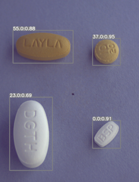

# 📌 Tablet Detection with Object Detection Models 

## 📖 프로젝트 개요

이 프로젝트는 다양한 배경과 각도에서 찾아내지는 정상 알약 이미지와 COCO 형식의 정보(이미지 및 바운딩 박스)를 통해, 다음의 **총 7가지 Object Detection 모델**을 활용하여 객체 탐지 및 클래스 예측 모델을 구현하는 프로젝트입니다.

각 모델의 성능을 시험적으로 비교한 후, 가장 성능이 우수했던 **YOLOv8l** 모델을 `main` 브랜치에 적용하였습니다.  
나머지 모델들은 각각 별도 브랜치에 구현되어 있게 설계되어 있으며, **코드 중심으로 구성되어 문서화나 가이드는 적은 편입니다.**

### 사용한 모델 목록:

- YOLOv8n 
- RT-DETR
- YOLOv8s
- YOLOv8l(`main` branch)
- Faster R-CNN
- RetinaNet
- SSD

---

## 🔧 사용 방법

### 1. GitHub 저장소 클론

```bash
git clone https://github.com/your-username/2025-health-vision.git
cd 2025-health-vision
```

### 2. 라이브러리 설치

```bash
conda env create -f environment.yml
conda activate tablet_detection
```

## 🩼 데이터 전처리 안내

AI Hub에서 데이터를 직접 다운로드한 경우 다음과 같은 전처리 과정을 거쳐야 합니다:

1. **이미지 통합 정리**
   - 다운로드된 원본 이미지들은 여러 개의 하위 폴더에 나누어 저장되어 있습니다.
   - `notebooks/data_preprocessing.ipynb` 파일에 포함된 코드를 실행해 **하나의 폴더로 통합**합니다.

2. **JSON 어노테이션 수정**
   - 원본 JSON 파일은 형식 오류가 있거나 모델 학습에 맞지 않게 구성되어 있을 수 있습니다.
   - 노트북 파일 내 수정 코드를 실행해 **올바른 포맷으로 정제**합니다.

3. **손상된 이미지 제거**
   - 일부 이미지 파일은 깨져 있거나 열 수 없는 경우가 있습니다.
   - 이를 자동으로 감지하여 제거하는 코드가 노트북에 포함되어 있습니다.

4. **CSV 변환**
   - 수정된 JSON 어노테이션을 COCO 형식 대신 **CSV 포맷**으로 변환하는 코드도 함께 제공됩니다.

모든 전처리 코드는 `01_EDA_and_Preprocessing.ipynb`에서 순차적으로 실행할 수 있습니다.

---

## 🔗 데이터 출처

- 본 프로젝트는 AI Hub에서 제공하는 공개 데이터셋을 활용하였습니다.
- 데이터셋 링크: [AI Hub - 의약품 이미지 객체 검출](https://www.kaggle.com/competitions/ai05-level1-project/data)

---

## 📷 예측 결과 예시



# 🏥 Kaggle Pill Detection - AI 기반 경구용 알약 탐지 시스템

[](https://python.org)
[](https://pytorch.org)
[](https://ultralytics.com)
[](LICENSE)

## 🎓 개발 과정 & 학습 성과

### Phase 1: 초기 구현
- ✅ YOLOv8n 기반 Baseline

### Phase 2: 모델 확장
- ✅ RT-DETR 추가 구현

### Phase 3: 아키텍처 리팩토링
- ✅ 추상화 인터페이스 설계
- ✅ 모듈식 패키지 구조

### Phase 4: 최적화 & 정리
- ✅ 코드 통합 및 문서화

### 지원 모델

| 모델 | 속도 | 정확도 | 특징 |
|------|------|--------|------|
| **YOLO** | ⚡ 빠름 | ✅ 높음 | 실시간 처리 최적화 |
| **RT-DETR** | 🚀 중간 | 🎯 매우높음 | Transformer 기반 정밀도 |


```

## 📈 데이터셋 정보

### 📊 구조 (4.21GB)
```
data/project/
├── 🖼️ train_images/           # 훈련 이미지들
├── 🖼️ test_images/            # 테스트 이미지들
└── 📝 train_annotations/      # COCO 어노테이션
```

### 🏷️ 클래스 정보
- **총 알약 수**: 73개 경구용 알약
- **형식**: COCO JSON, YOLO TXT 지원
- **해상도**: 가변 (자동 리사이즈)


## 🚀 향후 계획

### 🔮 단기 목표
- [ ] 모델 앙상블 기능
- [ ] 웹 인터페이스 개발
- [ ] 실시간 카메라 입력

### 🌟 장기 목표
- [ ] 모바일 앱 배포
- [ ] 클라우드 API 서비스
- [ ] 다국가 알약 DB 확장


##✅ 협업일지 링크: https://www.notion.so/292513a7d7a5802c9978c4317215d05f
##✅ 발표자료 링크: https://docs.google.com/presentation/d/1p0KDSR8E3O1xqBGfEDh7lOCh4f_pNWBsBHawtye8AkA/edit?slide=id.g1f87997393_0_782#slide=id.g1f87997393_0_782

*🏥 Built with ❤️ by Kaggle Tablet Detection 6 Team*